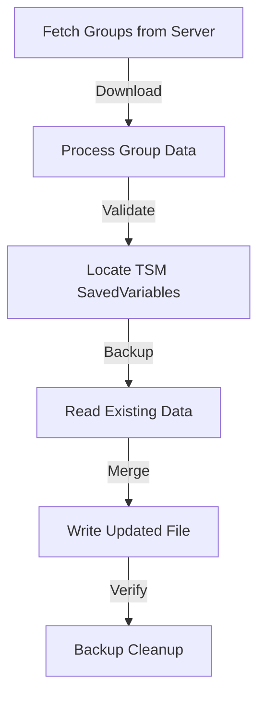

# TSM Group Data Sync System

## Overview
A system to collect World of Warcraft auction house data via Blizzard's API, process it into TradeSkillMaster (TSM) groups, and provide a client application for users to import these groups directly into their TSM SavedVariables.

## System Architecture

### Components

1. **Data Collection Server**
   - Python + FastAPI backend
   - Collects and processes auction data
   - Generates optimized TSM groups
   - Provides API endpoints for client

2. **Client Application**
   - Tauri (Rust + Web Frontend)
   - Cross-platform desktop application
   - Handles TSM file modifications
   - Auto-updates support

## Technical Implementation

### Server Stack
- **Language**: Python 3.11+
- **Framework**: FastAPI
- **Dependencies**:
  - `pandas` for data processing
  - `numpy` for calculations
  - `httpx` for async HTTP requests
  - `pydantic` for data validation
  - `sqlalchemy` for database (if needed)

### Client Stack
- **Framework**: Tauri 2.0
- **Frontend**: React + TypeScript
- **Backend**: Rust
- **Build System**: 
  - `cargo` for Rust
  - `npm` for frontend
  - `tauri-cli` for application

## Project Structure

```
tsm-group-sync/
├── server/
│   ├── app/
│   │   ├── main.py                 # FastAPI application entry
│   │   ├── config.py               # Configuration management
│   │   ├── blizzard/
│   │   │   ├── __init__.py
│   │   │   ├── api.py             # Blizzard API client
│   │   │   └── models.py          # API response models
│   │   ├── processing/
│   │   │   ├── __init__.py
│   │   │   ├── market_analysis.py # Market data processing
│   │   │   └── group_generator.py # TSM group generation
│   │   ├── models/
│   │   │   ├── __init__.py
│   │   │   ├── tsm_group.py      # TSM group structures
│   │   │   └── market_data.py    # Market data structures
│   │   └── utils/
│   │       ├── __init__.py
│   │       └── calculations.py    # Shared calculation utilities
│   ├── tests/
│   │   └── ...                    # Test files
│   ├── requirements.txt
│   └── README.md
│
├── client/
│   ├── src-tauri/
│   │   ├── src/
│   │   │   ├── main.rs           # Tauri application entry
│   │   │   ├── commands.rs       # Tauri command handlers
│   │   │   └── tsm/
│   │   │       ├── mod.rs
│   │   │       ├── file.rs       # TSM file operations
│   │   │       └── groups.rs     # Group data structures
│   │   ├── Cargo.toml
│   │   └── tauri.conf.json
│   ├── src/
│   │   ├── App.tsx              # React application entry
│   │   ├── components/          # React components
│   │   ├── hooks/              # Custom React hooks
│   │   └── utils/              # Frontend utilities
│   ├── package.json
│   └── README.md
│
└── README.md
```

## API Endpoints

### Server API

#### Authentication
```
POST /api/v1/auth/token
- Request Battle.net OAuth token
```

#### Realm Data
```
GET /api/v1/realms
- List available realms

GET /api/v1/realms/{region}
- Get realms for specific region
```

#### Market Data
```
GET /api/v1/market-data/{realm_id}
- Get processed market data for realm

GET /api/v1/market-data/{realm_id}/raw
- Get raw market data for realm
```

#### Groups
```
GET /api/v1/groups/{realm_id}
- Get generated groups for realm

POST /api/v1/groups/custom
- Create custom group configuration
```

## Data Structures

### TSM SavedVariables Format
```lua
TradeSkillMasterDB = {
    ["p@Default@userData@groups"] = {
        ["Imported Flips"] = {
            ["children"] = {
                ["High Volume"] = {
                    ["items"] = {"i:123", "i:456"}
                }
            }
        }
    }
}
```

### Market Data Model
```python
class MarketData(BaseModel):
    realm_id: str
    item_id: int
    market_value: float
    sale_rate: float
    daily_sold: int
    last_updated: datetime
```

### Group Configuration Model
```python
class GroupConfig(BaseModel):
    name: str
    criteria: Dict[str, Any]
    subgroups: List[str]
    operations: Dict[str, str]
```

## Development Setup

### Server Setup
1. Create Python virtual environment:
   ```bash
   python -m venv venv
   source venv/bin/activate  # or venv\Scripts\activate on Windows
   ```

2. Install dependencies:
   ```bash
   pip install -r requirements.txt
   ```

3. Configure environment:
   ```bash
   cp .env.example .env
   # Edit .env with your Battle.net API credentials
   ```

4. Run development server:
   ```bash
   uvicorn app.main:app --reload
   ```

### Client Setup
1. Install Node.js dependencies:
   ```bash
   cd client
   npm install
   ```

2. Install Rust and Tauri CLI:
   ```bash
   cargo install tauri-cli
   ```

3. Run development build:
   ```bash
   npm run tauri dev
   ```

## Deployment

### Server Deployment
- Deploy using Docker
- Use nginx as reverse proxy
- Set up SSL certificates
- Configure environment variables

### Client Distribution
- Build installers for Windows and macOS
- Set up auto-updater
- Configure code signing
- Distribute through GitHub releases

## Security Considerations

1. **API Security**
   - Use Battle.net OAuth
   - Rate limiting
   - Input validation
   - CORS configuration

2. **Client Security**
   - File system access restrictions
   - Backup creation before modifications
   - Validation of TSM file structure
   - Secure update mechanism

3. **Data Privacy**
   - No collection of account data
   - Local storage of preferences
   - Transparent data handling

## Future Enhancements

1. **Server**
   - Multiple region support
   - Advanced market analysis
   - Custom group templates
   - Historical data tracking

2. **Client**
   - Multiple account support
   - Group preview
   - Automatic scheduling
   - Backup management

## Contributing
1. Fork the repository
2. Create feature branch
3. Submit pull request
4. Follow code style guidelines
5. Include tests

## License
MIT License - See LICENSE file for details 

## WoW Integration

Unlike TSM's AppHelper which provides external market data, our system focuses solely on group management:

### Direct SavedVariables Integration
The desktop client will write directly to TSM's SavedVariables:
```lua
-- Location: WTF/Account/ACCOUNTNAME/SavedVariables/TradeSkillMaster.lua
TradeSkillMasterDB = {
    ["p@Default@userData@groups"] = {
        ["Imported Flips"] = {
            ["children"] = {
                ["High Volume"] = {
                    ["items"] = {"i:123", "i:456"}
                }
            }
        }
    },
    ["p@Default@userData@operations"] = {
        ["Shopping"] = {
            ["Imported Flip Operation"] = {
                ["maxPrice"] = "dbmarket * 0.5",
                ["restockQuantity"] = "10"
            }
        }
    }
}
```

### Client Responsibilities
1. **File Management**:
   - Locate correct WoW directory
   - Find account/realm folders
   - Backup existing SavedVariables
   - Safely modify TSM data

2. **Data Integration**:
   - Parse existing TSM groups
   - Merge new groups without disruption
   - Create necessary operations
   - Maintain group hierarchy

3. **Safety Measures**:
   - Validate file structure before modifying
   - Create backups before changes
   - Verify changes after writing
   - Handle file locking/access issues

### Desktop Client Flow
